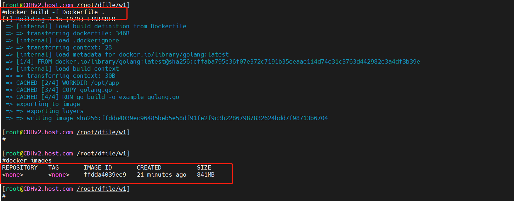
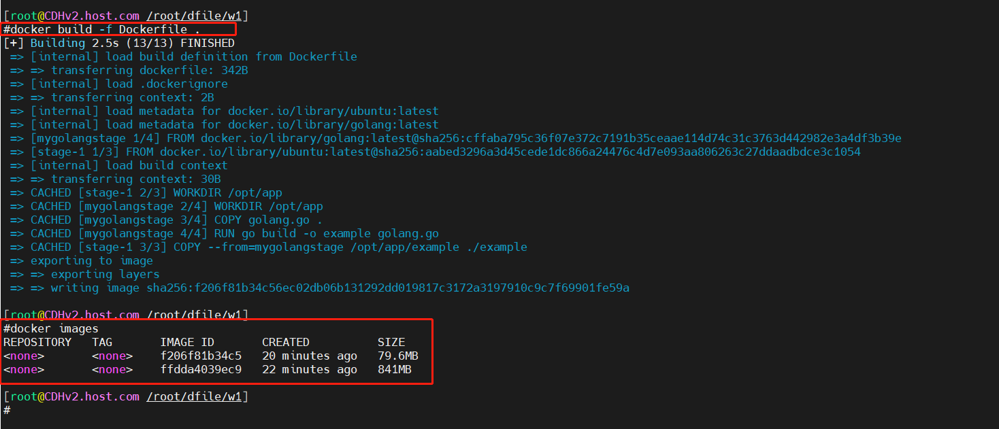

# devopscamp-xieshengsen
云原生DevOps进阶实战营 作业

## 简介
### 作业说明
请将以下 golang 代码构建为镜像，要求在能运行的情况下尽镜像体积尽可能小，上传你的 dockerfile 文件内容。
```
package main
import "fmt"
func main() {
    fmt.Println("hello world")
}
```

1. golang镜像构建

```
## golang镜像构建
## golang 代码构建为镜像
## v1

FROM golang:latest
WORKDIR /opt/app
COPY golang.go .
RUN go build -o example golang.go
CMD ["/opt/app/example"]
```

docker build -f Dockerfile .




2. 多阶段构建镜像。
```
## 多阶段构建
## golang 代码构建为镜像
## v2

FROM golang:latest AS mygolangstage
WORKDIR /opt/app
COPY golang.go .
RUN go build -o example golang.go
CMD ["/opt/app/example"]


FROM ubuntu:latest
WORKDIR /opt/app
COPY --from=mygolangstage /opt/app/example ./example
CMD ["/opt/app/example"]
```

docker build -f Dockerfile .



镜像大小从原来的 841MB变成了 79.6MB


